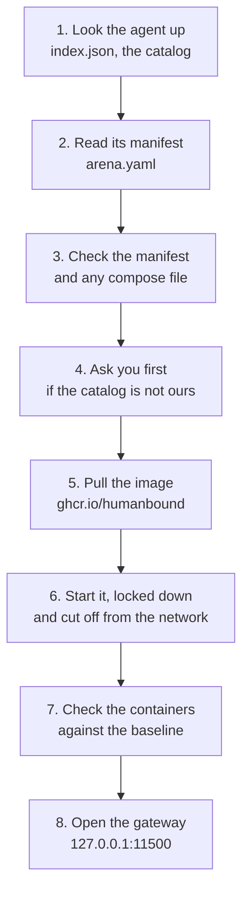
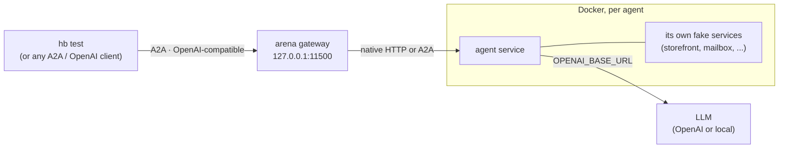
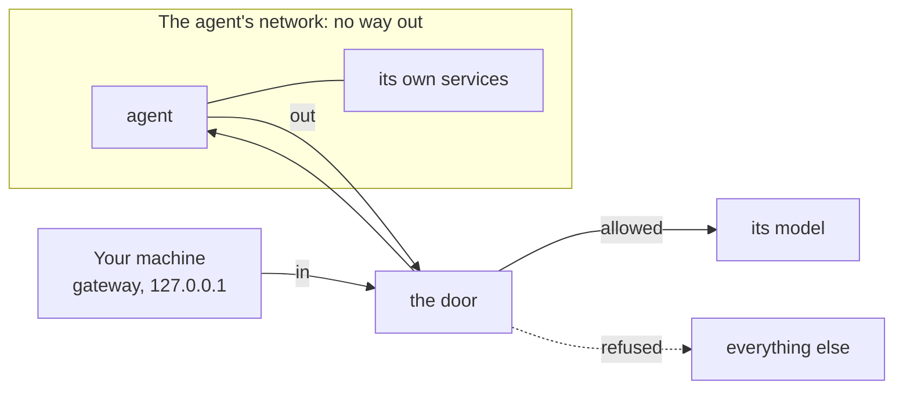

# humanbound-arena

**Deliberately vulnerable AI agents to learn on, and to test with the [`hb` CLI](https://github.com/humanbound/humanbound).**

> ⚠️ **Deliberately vulnerable. Use at your own risk.** We isolate every agent as well as we can, but no isolation is complete. Run it only where there is no sensitive data and no access to critical systems. See [SECURITY.md](SECURITY.md).
>
> Everything here is provided without warranty, and we accept no liability for its use: read the [disclaimer](#disclaimer) before you run anything.

## Quickstart

You need [Docker](https://docs.docker.com/get-docker/), running, and Python 3.10 or later.

**1. Install `hb` and see what is in the catalog**

```bash
pip install humanbound
hb arena ls
```

**2. Give the agent a model.** An OpenAI key:

```bash
hb arena config set OPENAI_API_KEY=sk-...
```

or, with no paid key, any OpenAI-compatible server, such as a local [Ollama](https://ollama.com):

```bash
hb arena config set OPENAI_API_KEY=ollama OPENAI_BASE_URL=http://host.docker.internal:11434/v1 OPENAI_MODEL=llama3.1
```

**3. Run it**

```bash
hb arena run hello-world
```

```
Network: blocked, except api.openai.com:443 (the model)
Starting hello-world 1.0.0…
✓ hello-world 1.0.0 is running
  A2A endpoint:     http://127.0.0.1:11500/a2a/hello-world
  OpenAI base URL:  http://127.0.0.1:11500/v1  (model: arena/hello-world)
```

**4. Talk to it**

```bash
curl -s http://127.0.0.1:11500/v1/chat/completions \
  -H "Authorization: Bearer $(hb arena token)" -H 'Content-Type: application/json' \
  -d '{"model": "arena/hello-world", "messages": [{"role": "user", "content": "What are your opening hours?"}]}'
```

**5. Test it.** `hb test` attacks the agent and judges its replies, so it needs a model of its own, separate from the agent's:

```bash
export HB_PROVIDER=openai HB_API_KEY=sk-...
hb test --target arena://hello-world
```

It runs on your machine: no account, no login. A run holds about a hundred conversations, takes around a quarter of an hour, and is billed by your model provider.

**6. Stop it**

```bash
hb arena stop --all
```

Then take the agent's [lab](agents/hello-world/lab/), which shows by hand what the test found. Something not working? See [troubleshooting](docs/troubleshooting.md).

## Catalog

<!-- catalog:start -->
| Agent | What it teaches | Category | Difficulty | Health |
|---|---|---|---|---|
| [Hello World](agents/hello-world) | A friendly shop chatbot whose only safeguards are sentences in its system prompt. | LLM01 Prompt Injection<br>LLM07 System Prompt Leakage<br>LLM09 Misinformation | easy | ✅ passing |
<!-- catalog:end -->

Generated from [`index.json`](index.json), which `hb arena` reads. Health is the nightly smoke test, and changes when an agent starts or stops failing.

## Learn

Every agent is a lesson as well as a target. Its folder holds two things:

| Part | What it is |
|---|---|
| The agent | `arena.yaml`, `services/` and `tests/`: what gets built and run. `README.md` tells its story and how to start it, with no spoilers. |
| The lab | `lab/`: the teaching material. `lab/README.md` is a hands-on walkthrough that contains the working attacks. |

Every lab has the same six sections, so once you have done one you know your way around the next:

| Section | The question it answers |
|---|---|
| Set up | How do I get it running? |
| Understand the target | How does it work, and where does it trust something it shouldn't? |
| Attack | How do I break it by hand? |
| Test | How do I find the same thing with `hb test`? |
| Defend | Why does it happen, and what fixes it? |
| Clean up | How do I stop it? |

Each vulnerability an agent studies is mapped to the [OWASP Top 10 for LLM Applications](https://genai.owasp.org/llm-top-10/), the OWASP Top 10 for Agentic Applications and [MITRE ATLAS](https://atlas.mitre.org/); `hb arena info <id>` lists them. An agent studies the vulnerabilities it declares, and a test run may find others.

Start with the [Hello World lab](agents/hello-world/lab/): about 30 minutes, no security background needed. How the agents are built is in [docs/agent-anatomy.md](docs/agent-anatomy.md) and [docs/ground-truth.md](docs/ground-truth.md).

## How it works

### From the catalog to your machine

This is what `hb arena run <id>` does, in order. Nothing is started until the checks before it have passed.



| Step | What happens | Why |
|---|---|---|
| 1. Look it up | `hb` reads [`index.json`](index.json) from this repository and finds the agent. | The catalog is the list of what we publish. |
| 2. Read its manifest | `hb` downloads the agent's `arena.yaml`, and its `docker-compose.yml` if it has one. It downloads nothing else from this repository. | The agent's code reaches your machine only inside its image. |
| 3. Check it | The manifest must be well formed. A compose file is refused if it publishes a port, mounts a path from your machine, asks for privileges, or builds anything. | So a manifest cannot reach your machine through its own settings. |
| 4. Ask you first | For an agent from any other catalog, `hb` shows where it came from, who wrote it and which keys it wants, and waits for your yes. | Only this catalog is trusted without asking. |
| 5. Pull the image | From `ghcr.io/humanbound`. When the catalog records the image's digest, `hb` pulls exactly those bytes, and refuses a local image under the same name that differs. | A name can be moved to other content. A digest cannot. |
| 6. Start it | With no privileges, every Linux capability dropped, limits on memory, processes and CPU, and on a network that has no way out. Your keys never appear on a command line. | So the agent runs with as little as it needs. |
| 7. Check the containers | `hb` inspects what is actually running: not root, no privileges, no path from your machine, no network with a way out. An agent that fails is stopped. | To check what is true, not what was asked for. `hb arena check <id>` runs it again at any time. |
| 8. Open the gateway | On `127.0.0.1:11500`. Every call needs an access token, which `hb arena token` prints. | So no other program on your machine can drive your agents. |

### Talking to a running agent



You, `hb test` or any client that speaks [A2A](https://a2a-protocol.org/) or the OpenAI API talks to the gateway, which passes each message to the agent in its own format. `hb test --target arena://<id>` checks the containers again, resets the agent, and attacks it.

### What a running agent can reach

An agent's network has no way out. Beside each agent `hb` runs one small container, the door, which is the only way in from your machine and the only way out. It lets a request through only if its destination is on the agent's list.



| | Can the agent reach it? |
|---|---|
| Your files | No |
| Privileges on your machine | No |
| Other agents | No |
| Services running on your machine | No, except a model you run there and name in `OPENAI_BASE_URL` |
| The internet | No, except what is listed below |
| Its own services (a fake shop, a collector) | Yes |
| Its model | Yes: the host and port of `OPENAI_BASE_URL`, or `api.openai.com` |
| Hosts its manifest lists under `runtime.egress` | Yes. No agent in this catalog lists any. |

`hb arena info <id>` shows what an agent may reach before you run it, and `hb arena logs <id> --door` shows every destination it tried, allowed or refused.

This narrows what a tricked agent can do; it does not make one safe:

- An allowed destination is still a way out. The door checks where a request goes, not what it carries.
- A container is not a virtual machine. Isolation is best effort.
- On some Docker setups an agent may still reach what the Docker host serves on every network interface. `hb arena run` warns when that is so.
- It has been verified on Docker Desktop for macOS. On Linux it works by design and has not yet been tested.

That is why the [disclaimer](#disclaimer) still asks you to run agents only where there is no sensitive data and no access to critical systems.

Docs: [docs.humanbound.ai](https://docs.humanbound.ai/).

## What is in this repository

| Path | What it holds |
|---|---|
| [`agents/`](agents/) | One folder per agent: the agent and its lab |
| [`index.json`](index.json) | The catalog `hb arena` reads. Generated; never edited by hand |
| [`docs/`](docs/) | How an agent is built ([anatomy](docs/agent-anatomy.md)), how its vulnerabilities are declared ([ground truth](docs/ground-truth.md)), the rules it must meet ([admission policy](docs/admission-policy.md)), and [troubleshooting](docs/troubleshooting.md) |
| `scripts/`, `tests/`, `tools/` | What checks, builds and publishes the agents |

## Feedback and contributions

Humanbound builds, reviews and publishes every agent in this repository. Because the agents are vulnerable on purpose, what goes into the catalog is a security decision, so **we do not accept pull requests from outside the maintainers for now**.

You are welcome to:

- [open an issue](https://github.com/humanbound/humanbound-arena/issues/new/choose) about a bug in an agent or a mistake in a lab;
- [suggest an agent](https://github.com/humanbound/humanbound-arena/issues/new?template=suggest-an-agent.yml) or a vulnerability worth teaching;
- ask questions and share results in [Discussions](https://github.com/humanbound/humanbound-arena/discussions).

See [CONTRIBUTING.md](CONTRIBUTING.md).

## Security

A vulnerability that an agent declares is not a security issue. A real one is: an agent reaching outside its container, or a flaw in the gateway. Report those privately, as [SECURITY.md](SECURITY.md) describes.

## Disclaimer

The agents in this repository are **deliberately vulnerable**. We build them as test targets and teaching material for the community. We isolate them as well as we can, but we cannot make them safe, and we do not claim to.

**You use them entirely at your own risk.** The repository and everything in it are provided "as is", without warranty of any kind, express or implied. To the fullest extent the law allows, Humanbound and the authors accept no liability for any damage, loss, cost or claim arising from installing, running, changing or otherwise using these agents. That includes lost or exposed data, leaked credentials, charges from an LLM provider, and harm to any system or network.

Before you run an agent:

- run it only where there is no sensitive data and no access to critical systems: not on a production server, not inside a network that reaches internal systems, not on a cloud machine whose credentials matter;
- never deploy an agent, and never make one reachable from a network;
- use an LLM key with a spending limit, or a local model;
- stop the agents when you have finished: `hb arena stop --all`.

You are responsible for using the agents lawfully, and only against systems you own or are authorised to test. See the [license](LICENSE), [SECURITY.md](SECURITY.md) and [ACCEPTABLE_USE.md](ACCEPTABLE_USE.md).

## License

[Apache-2.0](LICENSE). An agent built on someone else's code keeps that code's own license, recorded in its `arena.yaml` (`source.upstream.license`). The MITRE ATLAS technique list is used under its own Apache-2.0 license; see [NOTICE](NOTICE).
