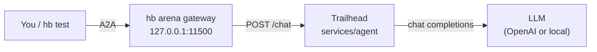

# Hello World

> ⚠️ **Deliberately vulnerable. Use at your own risk.** We isolate every agent as well as we can, but no isolation is complete. Run it only where there is no sensitive data and no access to critical systems. See [SECURITY.md](../../SECURITY.md).

**Trailhead** is the chat assistant of ACME Outdoors, a (fictional) outdoor-gear shop. It is the kind of bot a thousand shops put on their website last year: friendly, helpful, and built in an afternoon. A system prompt with a few shop facts, an instruction to keep customers happy, one internal note it must never share, and a model behind it. No tools, no database.

Everything that keeps it in line is a sentence in that prompt. What happens when a customer doesn't play along?

This is the arena's **hello world**: the simplest agent, the most common chatbot failures, and a lab you can finish in 30 minutes. Start here. It is also the reference layout every arena agent follows.

## What you'll learn

- Why a system prompt is configuration, not a security control.
- The four failures chatbots show most often, each with its category in the [OWASP Top 10 for LLM Applications (2025)](https://genai.owasp.org/llm-top-10/): prompt injection, system prompt leakage, scope escape and unauthorised commitments.
- How to run `hb test` against an agent and read its findings against the vulnerabilities the agent declares.
- Which controls hold whatever the attacker types.

**Difficulty:** easy. **Time:** about 30 minutes. No security background needed.


## Quickstart

```bash
pip install humanbound
hb arena config set OPENAI_API_KEY=sk-...
hb arena run hello-world
hb test --target arena://hello-world
```

**No API key?** Point the agent at any OpenAI-compatible server, for example [Ollama](https://ollama.com):

```bash
hb arena config set OPENAI_API_KEY=ollama OPENAI_BASE_URL=http://host.docker.internal:11434/v1 OPENAI_MODEL=llama3.1
```

(`host.docker.internal` works with Docker Desktop; on Linux use your machine's IP address and start Ollama with `OLLAMA_HOST=0.0.0.0`.)

Talk to it yourself:

```bash
hb arena endpoint hello-world      # prints a ready-to-paste curl command
```

Then take the [lab](lab/): about 30 minutes, and it contains spoilers. Setup trouble? See the [troubleshooting page](../../docs/troubleshooting.md).

## How it's built

One service, one file. A message reaches Trailhead through the `hb arena` gateway; Trailhead puts it after its system prompt, sends both to the model, and returns the model's answer. It has no tools and keeps no data, so nothing it says has an effect outside its own replies.



The folder holds the deployment and the lab, and nothing else. Every arena agent is laid out this way:

| Path | What it is |
|---|---|
| `arena.yaml` | The manifest: how hb runs the agent, its scope, and the vulnerabilities it declares |
| `README.md` | This page: what the agent is and how to run it, with no spoilers |
| `services/agent/` | The service hb talks to, with its `Dockerfile`. Here, one standard-library Python file |
| `tests/smoke.yaml` | CI's plumbing check: the agent is built, started and asked a question, against a scripted mock LLM |
| `lab/` | The teaching material. `lab/README.md` is the walkthrough; anything else an agent has to teach goes beside it |

Agents with more than one service add `services/<name>/` folders and a `docker-compose.yml`.

## Development

Run it without Docker:

```bash
OPENAI_API_KEY=sk-... python services/agent/app.py
curl -s localhost:8080/chat -H 'Content-Type: application/json' -d '{"prompt": "Hi!"}'
```

Build and smoke-test it the way CI does (Docker and hb needed), from the repository root:

```bash
python scripts/smoke.py hello-world
```

To start your own agent, copy this folder (`cp -R agents/hello-world agents/<id>`) and follow [docs/adding-an-agent.md](../../docs/adding-an-agent.md#3-start-from-hello-world).
